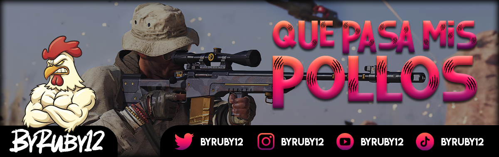
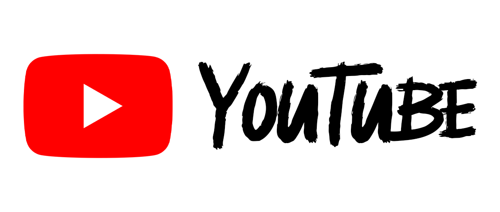
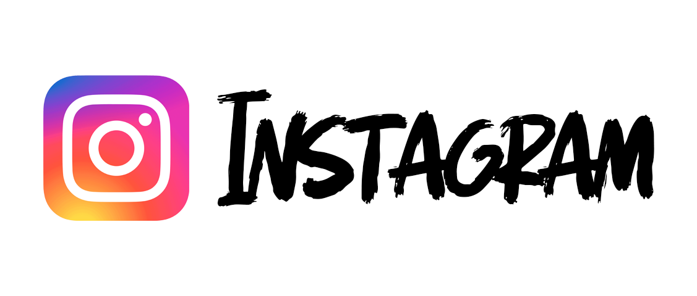
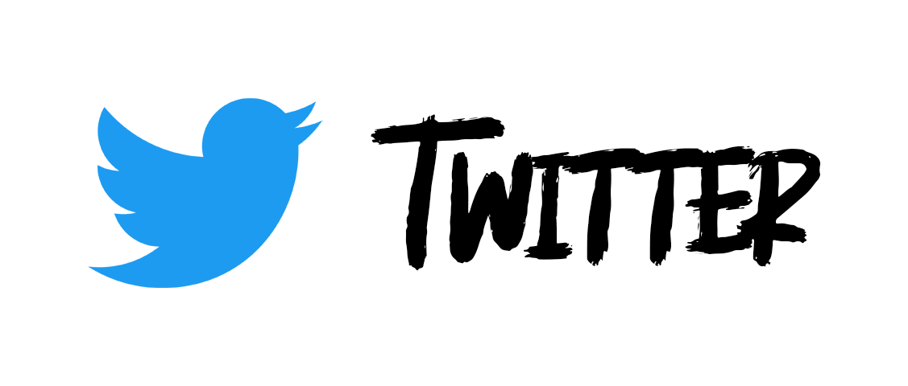
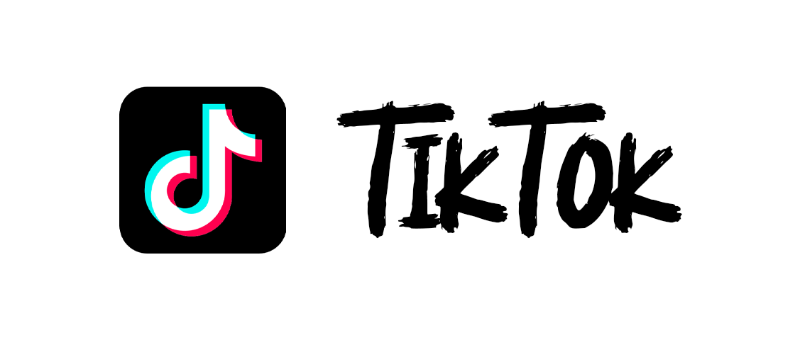
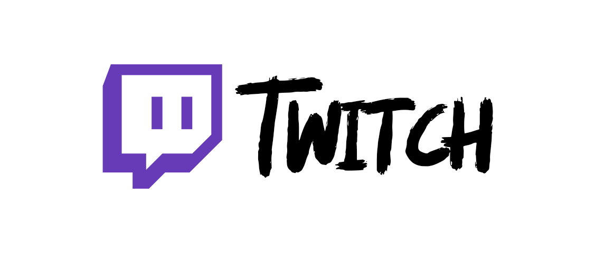
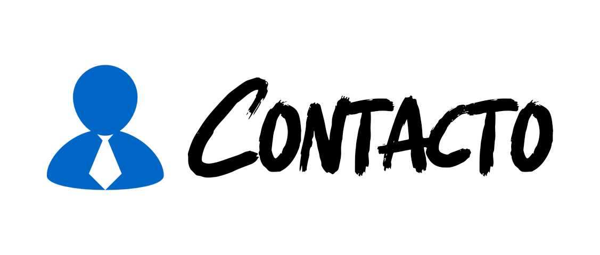
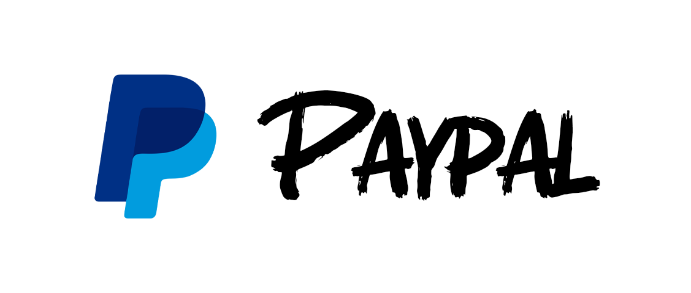
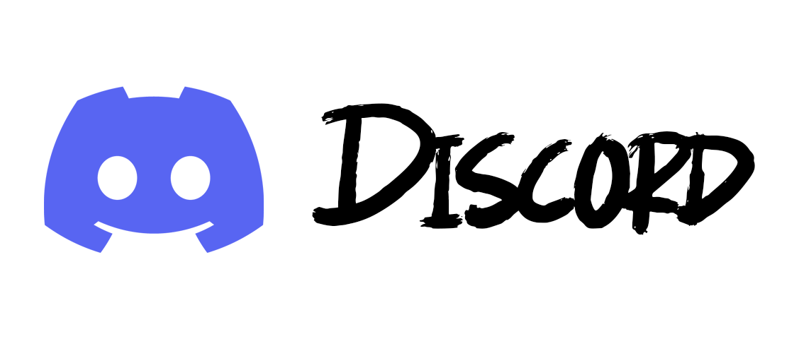
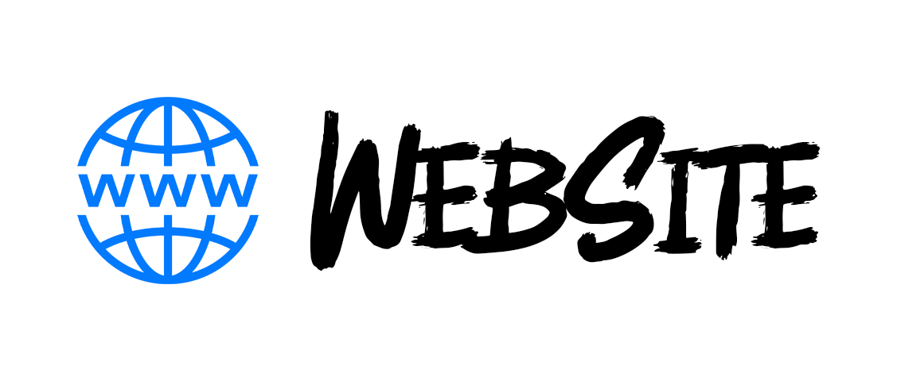

# ByRuby12 - Creador de contenido y desarrollador web

## 👋 ¡Hola! Soy ByRuby12

Soy un apasionado creador de contenido de videojuegos, desarrollador web y creador de proyectos digitales. Desde hace más de 9 años comparto contenido y experiencias con la comunidad a través de **YouTube, Twitch, TikTok, Instagram y Twitter**.

Mi perfil combina dos mundos que me apasionan: **la creación de contenido y la tecnología**. Me gusta convertir ideas en proyectos funcionales, cuidar el diseño y seguir aprendiendo nuevas herramientas para mejorar cada proyecto.

---

## 💻 ¿Qué hago?

### 🎮 Creación de contenido
- Videos, directos y gameplays de videojuegos
- Contenido para YouTube, Twitch, TikTok y redes sociales
- Edición de vídeo y creación de contenido digital
- Más de 9 años creando contenido y compartiendo proyectos con la comunidad

### 🌐 Desarrollo web
- Desarrollo de páginas web modernas, responsive y adaptadas a móviles
- Menús digitales para restaurantes y negocios mediante QR
- Webs corporativas y páginas personalizadas
- Sistemas de gestión y administración
- Integración de formularios, redes sociales, mapas y servicios externos
- Diseño de interfaces pensando tanto en la estética como en la experiencia de usuario

### 🧑‍💻 Programación
Trabajo con diferentes tecnologías y lenguajes, entre ellos:
- **HTML5, CSS3 y JavaScript**
- **TailwindCSS y Bootstrap**
- **Java, PHP y Python**
- **SQL y MariaDB**
- **Vue**
- **NestJS**
- **Firebase / Firestore**
- APIs e integraciones con servicios externos

### 🤖 Automatización y bots
También desarrollo herramientas para automatizar tareas y crear sistemas para comunidades:
- Discord Bots
- Telegram Bots
- Sistemas de roles y automatizaciones
- Sistemas de inventario, usuarios y economía
- Integración con bases de datos y servicios web

### 🎨 Diseño y edición
- Más de 6 años de experiencia con **Photoshop**
- Diseño de banners, carteles, interfaces y material para redes sociales
- Edición de vídeo
- Creación de recursos gráficos para proyectos digitales

### 🖥️ Sistemas y soporte informático
- Formación en sistemas informáticos
- Instalación y mantenimiento
- Configuración y optimización de equipos
- Resolución de problemas técnicos

---

## 🚀 Algunos de mis proyectos

### 🍽️ Menús digitales para restaurantes

Desarrollo soluciones de **cartas digitales mediante código QR**, pensadas para restaurantes, bares y negocios de hostelería.

Entre las funcionalidades que puedo integrar se encuentran:
- Categorías y productos
- Precios, descripciones y alérgenos
- Fotografías de productos
- Información del negocio
- Horarios, dirección y contacto
- Redes sociales
- Google Maps
- Varios idiomas
- Modo claro y oscuro
- Servicios de delivery como **Just Eat, Uber Eats y Glovo**
- Sistemas TPV y pedidos mediante QR

Algunos ejemplos de proyectos:

- **La Tortillería** — menú digital responsive con Firebase y sistema de administración.
- **BarNuevo** — menú digital configurable para hostelería.
- **CartaWebVersiones** — colección de versiones y recursos para cartas digitales.

### 📱 Expositores NFC para negocios

También trabajo con soluciones físicas y digitales mediante **NFC**, creando expositores configurados para facilitar el acceso de los clientes a redes sociales, reseñas, páginas web y otros recursos del negocio.

### 🎮 LeidersRP

Uno de mis proyectos más importantes es **LeidersRP**, un proyecto de GTA V Roleplay para **PS4 y PS5**.

El proyecto reúne desarrollo web, bots, sistemas de usuarios, economía, trabajos, inventarios, DNI, herramientas para Policía/EMS y diferentes sistemas destinados a gestionar una comunidad de roleplay.

### 🧪 Proyectos de aprendizaje y portfolio

Mi GitHub también reúne proyectos realizados durante mi formación y aprendizaje en **Desarrollo de Aplicaciones Web (DAW)**, además de pruebas, experimentos, aplicaciones y proyectos personales.

---

## 🛠️ Mi enfoque

Me gusta trabajar en proyectos en los que pueda combinar:

**💡 Idea → 🎨 Diseño → 💻 Desarrollo → 🧪 Pruebas → 🚀 Publicación**

No me limito únicamente a escribir código: también me interesa entender el proyecto completo, desde cómo se presenta visualmente hasta cómo funciona internamente.

---

## 📂 Repositorios

Aquí encontrarás una colección de proyectos, pruebas, recursos y aplicaciones que he desarrollado o en los que he trabajado.

Cada repositorio representa una parte de mi aprendizaje y evolución como desarrollador.

---

## 🌐 Encuéntrame en:

---

## 🤝 ¿Tienes un proyecto en mente?

Si necesitas una página web, un menú digital para tu negocio, una solución personalizada, automatizaciones, un bot o simplemente quieres hablar sobre un proyecto, puedes contactar conmigo.

**Gracias por visitar mi perfil y echar un vistazo a mis proyectos. 🚀**

