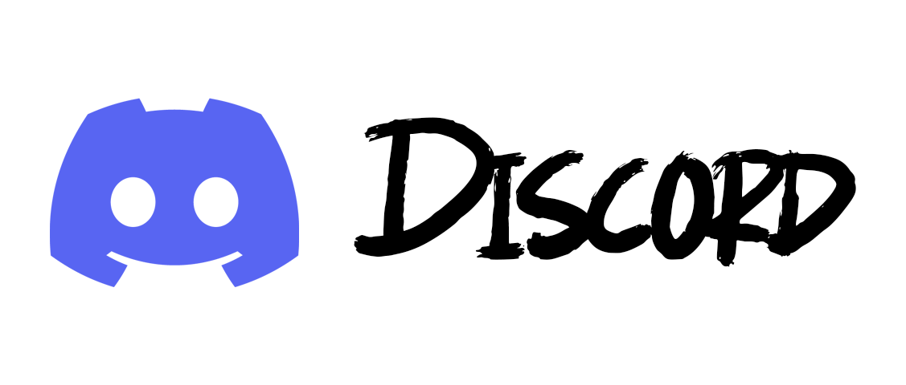

# ByRuby12 - Creador de contenido y desarrollador web

## 👋 ¡Hola! Soy ByRuby12

Soy un apasionado creador de contenido de videojuegos y desarrollador de aplicaciones web. Desde hace más de 9 años, comparto mi diversión con la comunidad a través de plataformas como **YouTube**, **Twitch**, **TikTok**, **Instagram** y **Twitter**.

Además de crear contenido, me dedico profesionalmente al mundo de la tecnología.

---

## 💻 ¿Qué hago?

### 🎮 Creador de contenido
- Videos y directos de videojuegos
- Series, gameplays y contenido variado
- Más de 9 años de experiencia creando y editando

### 🧑‍💻 Desarrollo web y programación
- Experiencia en múltiples lenguajes:
  - HTML, CSS, Tailwind, Bootstrap
  - JavaScript, Java, PHP, Python
  - SQL, Vue y más...
- Creación de sitios web y aplicaciones personalizadas

### 🧠 Tecnologías y herramientas avanzadas
- Conocimientos en inteligencia artificial (IA)
- Uso de bases de datos como MariaDB
- Desarrollo backend con NestJS
- Maquetación moderna con TailwindCSS
- Bots automatizados:
  - 🤖 Telegram Bot
  - 🤖 Discord Bot

### 🎨 Diseño gráfico y edición
- Más de 6 años de experiencia en **Photoshop**
- Edición de video para redes sociales y YouTube

### 🛠️ Técnico en sistemas
- Formación y experiencia en soporte informático
- Mantenimiento, instalación y optimización de sistemas

---

## 📂 Repositorios

Aquí encontrarás una colección de proyectos y recursos que comparto con la comunidad. ¡Espero que te resulten útiles o interesantes!

---

## 🌐 Encuéntrame en:

---

## 🤝 ¡Estoy aquí para ayudarte!

Si necesitas algo o quieres contactar conmigo, no dudes en escribirme. ¡Gracias por visitar mi perfil y echar un vistazo a mis proyectos!
