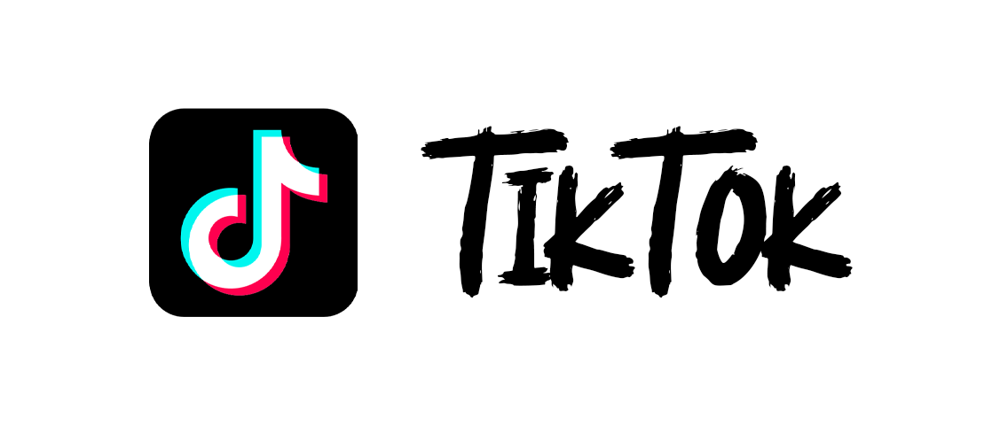

# ByRuby12 - Creador de contenido de videojuegos y diseñador de aplicaciones web

### Hola, soy ByRuby12, un creador de contenido de videojuegos que sube videos y directos a las redes sociales para pasárselo bien y compartirlo con la audiencia. Llevo haciendo todo tipo de contenido desde hace 5 años desde la plataforma de YouTube y después de unos años me desplace a más redes sociales como Instagram, Twitter, TikTok y Twitch.

### Aparte de este hobby que tengo, me dedico a programar en todo tipo de lenguajes como HTML, CSS, JS, JAVA y SQL. También soy diseñador gráfico desde hace más de 4 años en PhotoShop y como último soy técnico en sistemas informáticos (Básicamente, todo lo relacionado con la informática, es lo que me apasiona en este mundillo).

#### Espero que os guste todos los repositorios de GitHub, os dejo por aqui todas mis redes sociales aquí abajo y cualquier cualquier cosa que necesiteis estoy por aquí. 
#### Un saludo

 
 
 
 

 
 
 
 

